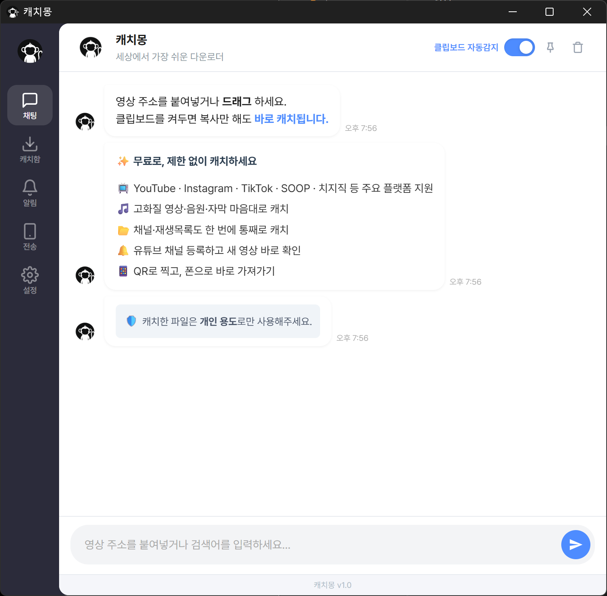
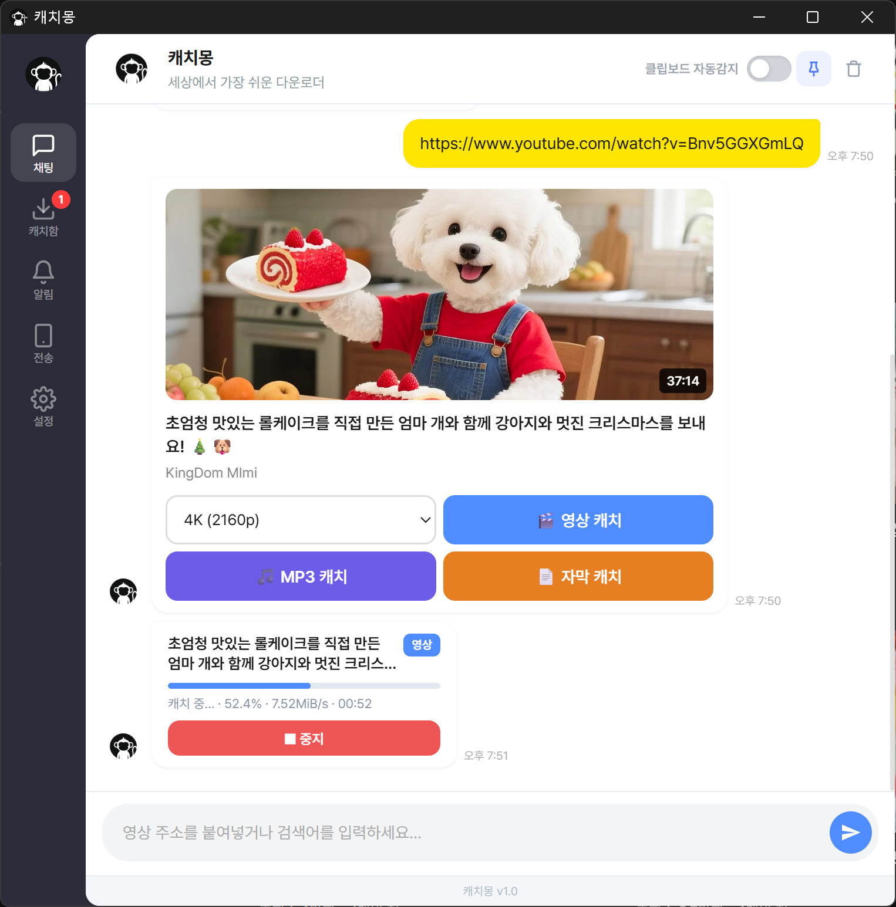
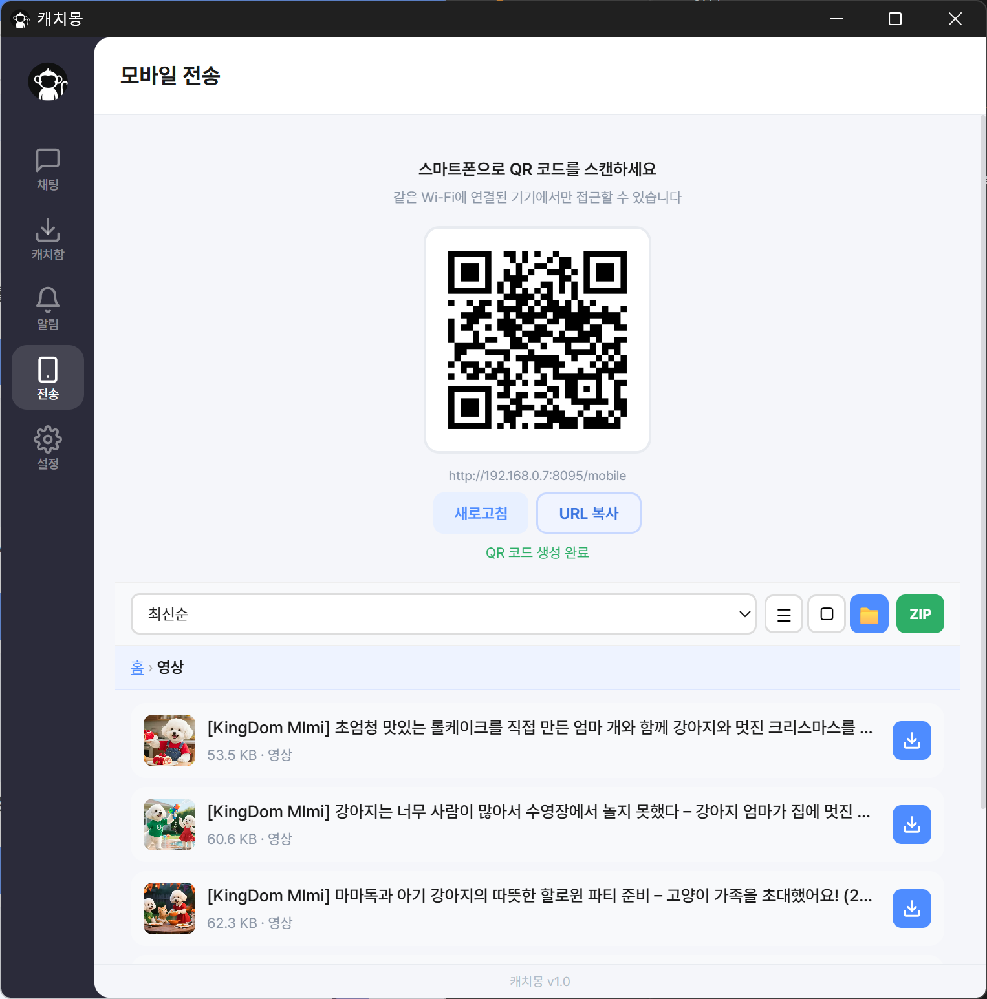

  
  
  # 캐치몽 (CatchMong)
  **세상에서 가장 쉬운 비디오 다운로더**

  
  
  

    
  
    

  <h3>
    <a href="https://github.com/Gorf-soft/CatchMong/releases/latest/download/CatchMong_Installer.exe">
      🚀 [ 100% 무료 다운로드 (Windows 전용) ]
    </a>
  </h3>
  
회원가입 없음 · 광고 없음 · 평생 무료

 

## ✨ 캐치몽의 압도적인 차이
기존 다운로더들의 복잡한 영어 메뉴, 덕지덕지 붙은 광고, 느린 속도에 지치셨나요? 
캐치몽은 **채팅하듯 주소만 툭 던지면 알아서 캐치해 주는** 신개념 미디어 어시스턴트입니다.

* **🎬 영상·음원·자막 즉시 추출:** 최고 화질 영상(4K)은 물론, 차량용 MP3, 어학용 자막까지 한 번에!
* **📦 재생목록 통째로 캐치:** 영상 하나씩 받을 필요 없이, 채널이나 재생목록 주소 하나면 100개든 1,000개든 일괄 저장.
* **🔔 업계 최초! 유튜브 채널 알림:** 즐겨보는 채널을 등록해두면 새 영상이 올라올 때마다 몽이가 채팅으로 알려줍니다.
* **📱 QR 코드로 스마트폰 즉시 전송:** PC에 받은 트로트 MP3, 케이블 연결 없이 QR코드만 찍어서 폰으로 쏙!
* **🔄 무설정 자동 업데이트:** 깃허브와 연동되어 백그라운드에서 조용히 최신 버전으로 진화합니다.

---

## 📖 세상에서 가장 쉬운 사용 방법

1. **주소 복사:** 유튜브, 인스타그램, 틱톡 등에서 원하는 영상의 링크를 복사합니다. (클립보드 감지를 켜두면 복사만 해도 자동 인식!)
2. **버튼 클릭:** 채팅창에 영상 정보가 뜨면 `[영상 캐치]` 또는 `[MP3 캐치]` 버튼을 누릅니다.
3. **끝!** 좌측 `[캐치함]`에서 다운로드 진행 상황을 확인하고 폴더를 열 수 있습니다.

 

  

    

      <h4 style="margin-bottom: 8px;"> · 형식 선택</h4>
      
      
원하는 영상·음원·자막 형식을 간편하게 캐치합니다.

    

    

      <h4 style="margin-bottom: 8px;"> · QR 스마트폰 전송</h4>
      
      
케이블 없이 QR 코드 스캔으로 폰으로 즉시 전송합니다.

    

    

      <h4 style="margin-bottom: 8px;"> · 채널 새 영상 알림</h4>
      
      
즐겨보는 채널을 등록하고 새 영상 소식을 채팅으로 받습니다.

    

  

---

## 🌐 공식 홈페이지
캐치몽에 대한 더 자세한 정보와 가이드는 공식 홈페이지에서 확인하실 수 있습니다.
👉 **[catchmong.co.kr](https://catchmong.co.kr/)**

---
*본 프로그램은 개인적인 소장 및 학습 용도로만 사용해야 하며, 저작권이 있는 콘텐츠의 무단 배포를 엄격히 금지합니다.*
